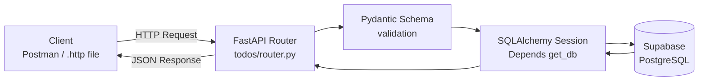
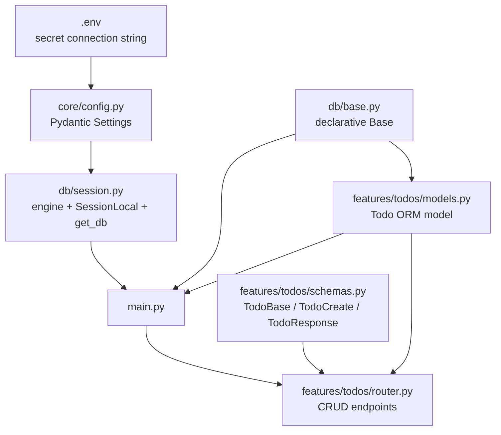
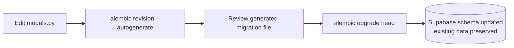

# ToDo API — FastAPI + SQLAlchemy + Supabase + Alembic

A hands-on learning project. The ToDo app itself is just a vehicle — the real
goal was to learn, end-to-end, how a production-style FastAPI backend is
structured and connected to a real cloud PostgreSQL database.

## Learning Goals (Achieved)

- ✅ FastAPI fundamentals — routing, path parameters, request/response validation
- ✅ Feature-based, industry-standard project structure
- ✅ Pydantic schemas for input/output validation
- ✅ SQLAlchemy ORM connected to a real database (Supabase / PostgreSQL)
- ✅ Secure configuration management (`.env` + Pydantic Settings)
- ✅ Alembic for versioned, data-safe database migrations
- ✅ Full CRUD flow tested via PyCharm HTTP Client and Postman

## Tech Stack

| Layer | Technology |
|---|---|
| Web framework | FastAPI |
| Data validation | Pydantic |
| ORM | SQLAlchemy |
| Database | PostgreSQL (hosted on Supabase) |
| Migrations | Alembic |
| Server | Uvicorn |
| Config | python-dotenv / pydantic-settings |

## Architecture — Request Flow



## Architecture — Setup / Connection Flow



## Project Structure

```
FastAPI_Project_with_SQLAlchemy/
├── .env                        # secrets (gitignored)
├── .env.example
├── alembic.ini
├── alembic/
│   ├── env.py                  # Alembic ↔ SQLAlchemy models bridge
│   └── versions/                # migration history
├── src/
│   ├── main.py                  # app entrypoint, router + table registration
│   ├── core/
│   │   └── config.py             # reads .env via Pydantic Settings
│   ├── db/
│   │   ├── base.py               # shared declarative Base
│   │   └── session.py            # engine, SessionLocal, get_db dependency
│   └── features/
│       └── todos/
│           ├── schemas.py         # Pydantic request/response models
│           ├── models.py          # SQLAlchemy ORM model (todos table)
│           └── router.py          # CRUD API endpoints
└── test_my_first_fastapi_project_app.http   # manual endpoint tests
```

## Database Schema — `todos` table

| Column | Type | Constraint |
|---|---|---|
| `id` | Integer | Primary Key |
| `title` | String | Not Null |
| `description` | String | Nullable |
| `priority` | Integer | Not Null, default `1` |
| `completed` | Boolean | Not Null, default `false` |
| `created_at` | DateTime (tz) | Not Null, default: server-generated |

## API Endpoints

| Method | Path | Description |
|---|---|---|
| `POST` | `/todos/` | Create a new todo |
| `GET` | `/todos/` | List all todos |
| `GET` | `/todos/{todo_id}` | Get a single todo |
| `PUT` | `/todos/{todo_id}` | Update a todo |
| `DELETE` | `/todos/{todo_id}` | Delete a todo |

Interactive docs available at `/docs` (Swagger UI) and `/redoc` (ReDoc) once
the server is running.

## Migration Workflow



## Running Locally

1. Create and activate a virtual environment.
2. Install dependencies: `fastapi[standard]`, `sqlalchemy`, `psycopg2-binary`,
   `python-dotenv`, `pydantic-settings`, `alembic`.
3. Create a `.env` file with the Supabase (Session pooler) connection string.
4. Run the latest migrations: `alembic upgrade head`.
5. Start the dev server: `uvicorn src.main:app --reload`.
6. Test via `/docs`, Postman, or the included `.http` file.

## Status

✅ **Core learning goals complete.** This project successfully demonstrates a
working FastAPI backend connected to a real PostgreSQL database via
SQLAlchemy, with Alembic-managed, data-safe schema migrations.

## Possible Future Enhancements

*(Not implemented — this project's scope was intentionally kept focused on
the core stack above.)*

- Service / repository layer separation
- User authentication (JWT)
- Centralized exception handling
- Automated tests with pytest
